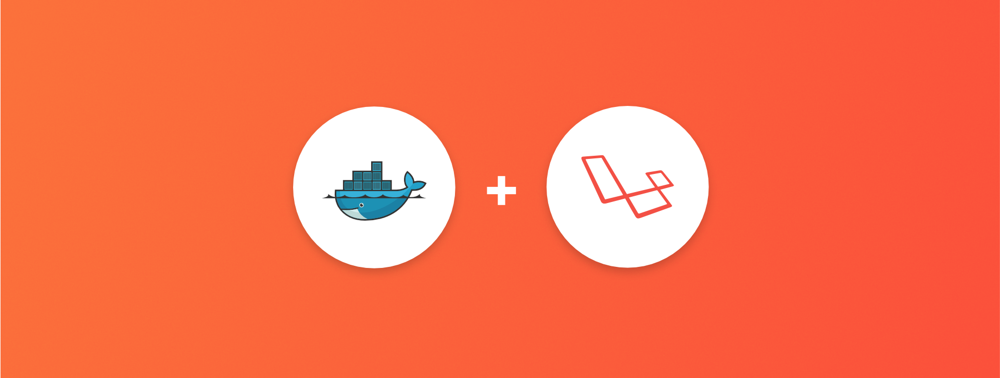

## 项目介绍

> [houdunren.com](https://www.houdunren.com) @ 向军大叔


本项目是高可用的LNMP开发环境，同时支持代理转发，实现单台服务器运行多个DOCKER网站。

> 本项目为视频代码或直播课程代码，希望大家能给个 `star` 这是对我们最好的鼓励和肯定。



**项目特点**

1. 保持使用较新版本的NGINX/PHP/MYSQL环境套件
2. 容器参数可自定义配置
3. 如有问题请在[后盾人](https://www.houdunren.com)反馈，会得到及时处理

### 获取帮助

[后盾人](https://www.houdunren.com) 已经发布了DOCKER相关视频教程，可以帮助你掌握DOCKER技术。

Github 仓库：https://github.com/houdunwang/docker

Gitee 仓库：https://gitee.com/houdunren/docker

## 安装使用

从 **GITHUB** 或 **GITEE** 下CLONE项目代码

```
cd 
git clone https://gitee.com/houdunren/docker.git
cd docker
```

### 配置参数

通过修改 **.env** 可以对容器的参数进行定制，比如数据库帐号密码等

```
#容器名前缀
CONTAINER_NAME_PRE=houdunren

#宿主机映射到容器的端口
PORT=8080

#ROOT管理员密码
MYSQL_ROOT_PASSWORD=admin888

#新建数据库
MYSQL_DATABASE=houdunren

#新建普通用户帐号密码
MYSQL_USER=houdunren
MYSQL_PASSWORD=houdunren

#MYSQL初始后强制ROOT帐号改密码
MYSQL_ONETIME_PASSWORD=no

#允许MYSQL空密码
MYSQL_ALLOW_EMPTY_PASSWORD
```

### 编译执行

执行以下命令将编译镜像并启动容器

```
docker-compose up -d
```

查看容器

```
docker ps
```

现在可以通过 `http://localhost/8080` 访问项目了

