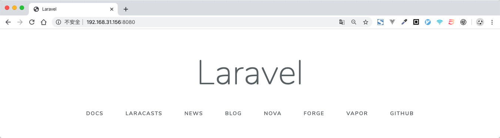
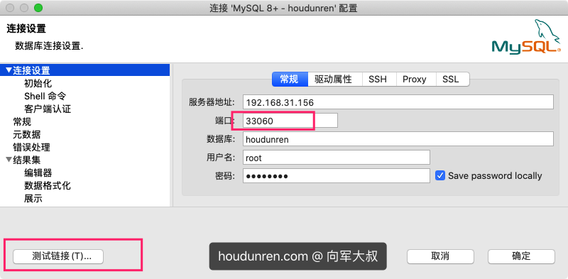

## 项目介绍

> [houdunren.com](https://www.houdunren.com) @ 向军大叔


本项目是高可用的LNMP开发环境，同时支持代理转发，实现单台服务器运行多个DOCKER网站。

> 本项目为视频代码或直播课程代码，希望大家能给个 `star` 这是对我们最好的鼓励和肯定。


**项目特点**

1. 保持使用较新版本的NGINX/PHP/MYSQL/REDIS环境套件
2. 容器参数可自定义配置
3. 如有问题请在[后盾人](https://www.houdunren.com)反馈，会得到及时处理

### 获取帮助

[后盾人](https://www.houdunren.com) 已经发布了DOCKER相关视频教程，可以帮助你掌握DOCKER技术。

Github 仓库：https://github.com/houdunwang/docker

Gitee 仓库：https://gitee.com/houdunren/docker

## 安装配置

从 **GITHUB** 或 **GITEE** 下CLONE项目代码

```
cd 
git clone https://gitee.com/houdunren/docker.git
cd docker
```

**目录说明**

下面是实验的文件结构，便于有个全局认识

```
.
├── app										应用目录
│   ├── index.php
│   └── phpinfo.php
├── docker-compose.yaml	
├── mysql									MYSQL容器
│   ├── Dockerfile				镜像配置
│   ├── data							数据结构
│   └── log								运行日志
├── nginx						
│   ├── Dockerfile
│   ├── config
│   │   └── default.conf	NGINX配置
│   └── log								运行日志
│       ├── access.log
│       └── error.log
└── php
    ├── Dockerfile
    └── config
        └── php.ini				PHP配置文件
```

### 配置参数

通过修改 **.env** 可以对容器的参数进行定制，比如数据库帐号密码等

```
#容器名前缀
CONTAINER_NAME_PRE=houdunren

#宿主机映射到容器的端口
PORT=8080

#ROOT管理员密码
MYSQL_ROOT_PASSWORD=admin888

#新建数据库
MYSQL_DATABASE=houdunren

#新建普通用户帐号密码
MYSQL_USER=houdunren
MYSQL_PASSWORD=houdunren

#MYSQL初始后强制ROOT帐号改密码
MYSQL_ONETIME_PASSWORD=no

#允许MYSQL空密码
MYSQL_ALLOW_EMPTY_PASSWORD
```

### 编译执行

执行以下命令将编译镜像并启动容器

```
docker-compose up -d
```

查看容器

```
docker ps
```

现在可以通过 `http://localhost/8080` 访问项目了


## LARAVEL

下面来安装LARAVEL项目，你可以安装任何其它PHP项目来使用，具体可以查看[后盾人](https://www.houdunren.com)在线文档或视频学习LARAVEL的安装使用。

```
cd app
rm *
laravel new .
```

因为LARAVEL要解析到**public**目录，修改NGINX配置文件 `nginx/config/default.conf` 目录相关内容

```
location / {
  root   /www/public; 
  index  index.html index.htm index.php;
}
...
location ~ \.php$ {
  ...
  fastcgi_param  SCRIPT_FILENAME  /www/public$fastcgi_script_name;
  ...
}
```

现在访问就可以看到LARAVEL欢迎页面了



## 数据库连接

下面我们使用MYSQL管理GUI工具DBeaver连接容器数据库

登录服务器允许root帐号远程访问

1. 进入容器

   ```
   docker exec -it houdunren-mysql /bin/bash
   ```

2. 登录mysql

   ```
   $ mysql -uroot -p
   ```

3. 修改权限

   ```
   mysql> ALTER USER 'root'@'%' IDENTIFIED WITH mysql_native_password BY 'admin888';
   mysql> flush privileges;
   ```

4. 使用DBeaver访问

   

## 